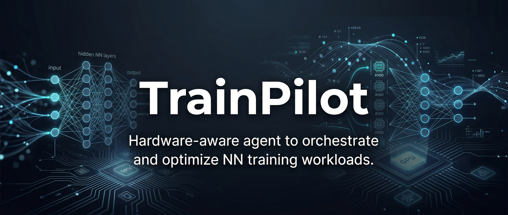

<p align="center">
  
</p>

<h1 align="center">TrainPilot</h1>

<p align="center">
  <strong>Hardware-aware agent to orchestrate and optimize NN training workloads.</strong>
</p>

<p align="center">
  <a href="https://github.com/Lumi-node/train-pilot"></a>
  <a href="https://github.com/Lumi-node/train-pilot"></a>
  <a href="https://github.com/Lumi-node/train-pilot"></a>
</p>

---

TrainPilot is a specialized agent designed to intelligently orchestrate and optimize the execution of neural network training workloads across heterogeneous hardware environments, specifically targeting Apple Neural Engine (ANE) and CPU backends. It addresses the complex challenge of routing ML tasks to the most performant accelerator available, a problem currently unaddressed by commercial tooling.

The core functionality revolves around a ReasoningAgent that observes workload characteristics—such as model architecture complexity, dataset size, and real-time hardware utilization—to make informed decisions. It dynamically selects the optimal training backend, aiming for significant speedups over naive or random hardware assignment.

---

## Quick Start

```bash
pip install train_pilot
```

```python
from train_pilot.train_orchestrated import TrainOrchestrator

# Initialize the orchestrator
orchestrator = TrainOrchestrator()

# Run the workload profiling and selection process
result = orchestrator.profile_workload(model_config, dataset_info)

print(f"Optimal backend selected: {result.backend}")
```

## What Can You Do?

### Workload Profiling
The agent can analyze a given model and dataset to extract crucial complexity metrics necessary for performance prediction.

```python
from train_pilot.hardware_orchestrator import HardwareOrchestrator

orchestrator = HardwareOrchestrator()
metrics = orchestrator.profile_workload(model_architecture, dataset_size)
print(f"Model complexity score: {metrics.complexity}")
```

### Performance Prediction and Selection
Based on observed metrics and historical data, TrainPilot estimates training time and selects the best hardware backend (ANE or CPU).

```python
# Assuming metrics were gathered previously
estimated_time = orchestrator.predict_performance(metrics)
selected_backend = orchestrator.select_backend(metrics, current_utilization)
print(f"Estimated time: {estimated_time}s, Chosen backend: {selected_backend}")
```

## Architecture

TrainPilot operates around a central `ReasoningAgent` housed within `hardware_orchestrator.py`. This agent acts as the decision-maker, consuming inputs from workload analysis and hardware monitoring.

The flow is as follows:
1. **Input:** Workload definition (Model, Data) $\rightarrow$ `profile_workload()`
2. **Analysis:** Metrics are generated (Complexity, Size) $\rightarrow$ `predict_performance()`
3. **Decision:** The agent compares predicted performance against current hardware state $\rightarrow$ `select_backend()`
4. **Execution:** The decision triggers the appropriate training invocation (e.g., `ane_trainer` or CPU fallback) managed by `train_orchestrated.py`.

```mermaid
graph TD
    A[Workload Input] --> B(HardwareOrchestrator);
    B --> C{profile_workload()};
    C --> D[Metrics];
    D --> E{predict_performance()};
    E --> F{select_backend()};
    F --> G[TrainOrchestrator];
    G --> H{ANE Trainer / CPU Fallback};
```

## API Reference

### `HardwareOrchestrator`
Manages the profiling and decision-making logic.

- `profile_workload(model_architecture, dataset_size) -> WorkloadMetrics`: Extracts complexity metrics from the input configuration.
- `predict_performance(metrics, utilization) -> float`: Estimates the required training time based on current conditions.
- `select_backend(metrics, utilization) -> str`: Returns the optimal backend ('ANE' or 'CPU').

### `TrainOrchestrator`
Handles the end-to-end workflow, integrating profiling with execution.

- `__init__()`: Initializes the underlying orchestrator components.
- `run_training_pipeline(config) -> TrainingResult`: Executes the full cycle: profile $\rightarrow$ select $\rightarrow$ train.

## Research Background

This project is inspired by the growing need for efficient resource utilization in edge and local ML inference/training, particularly where proprietary hardware accelerators (like ANE) are involved. The underlying concepts draw from dynamic resource scheduling algorithms used in cloud computing, adapted for the constraints of local, heterogeneous silicon.

## Testing

Tests are maintained in the `tests/` directory and cover the core logic of workload profiling and backend selection, ensuring the agent correctly routes workloads for small CNNs, large dense models, and sequential models.

## Contributing

We welcome contributions! Please see our contribution guidelines for details on submitting pull requests, reporting bugs, or suggesting features.

## Citation

This work is independent, but related research in heterogeneous computing can be found in papers concerning dynamic workload migration and accelerator offloading.

## License
The project is licensed under the MIT License - see the [LICENSE](LICENSE) file for details.